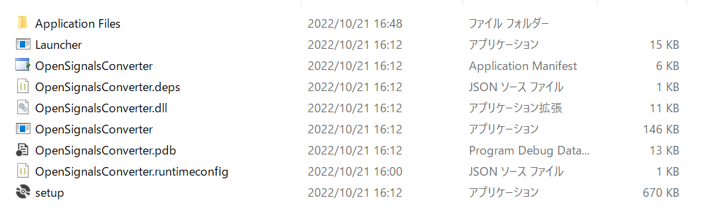
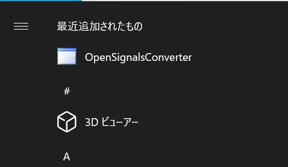
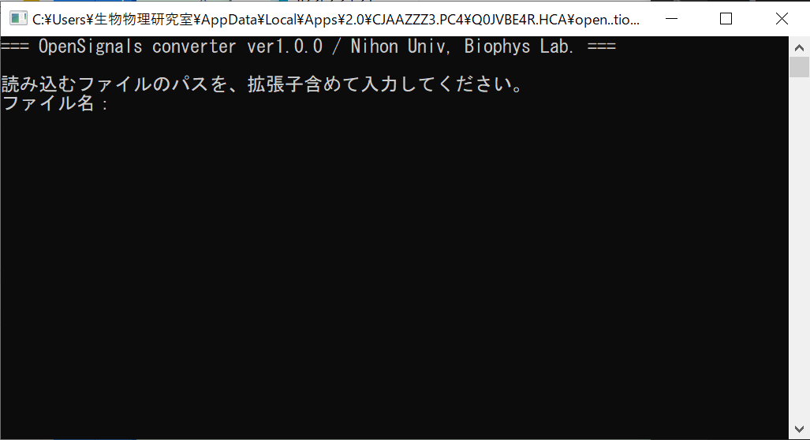
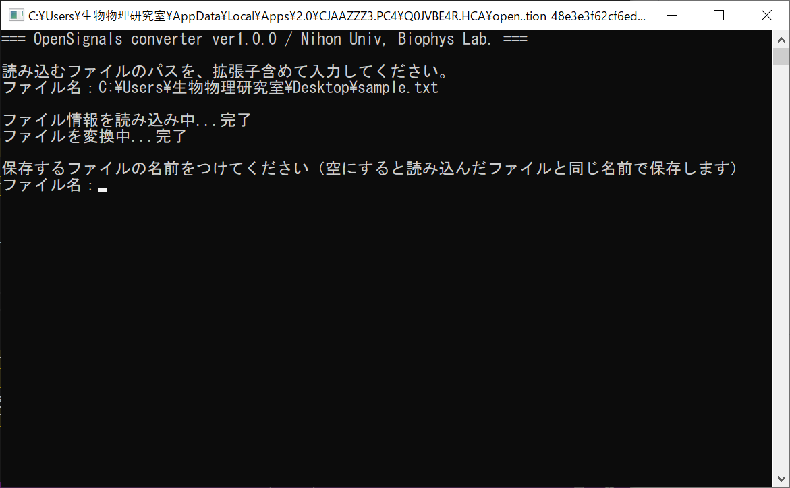
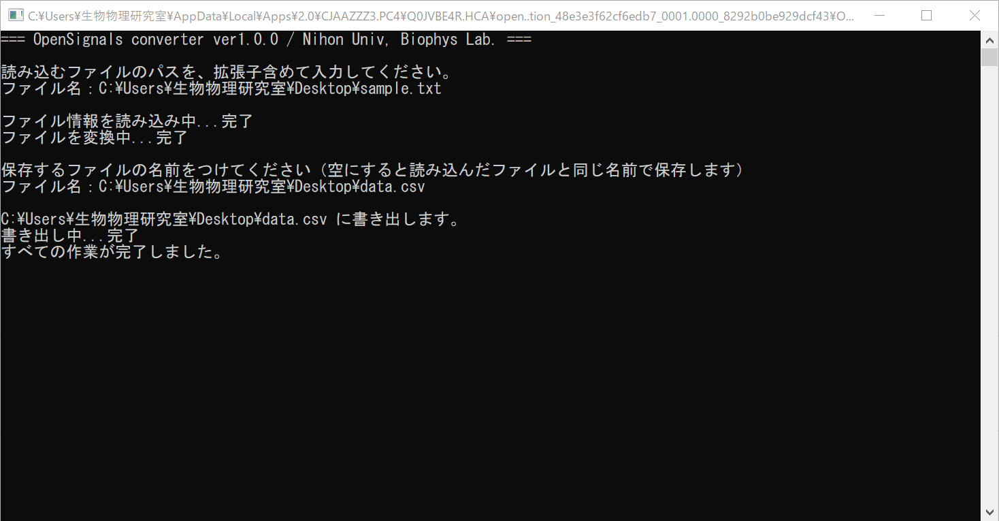
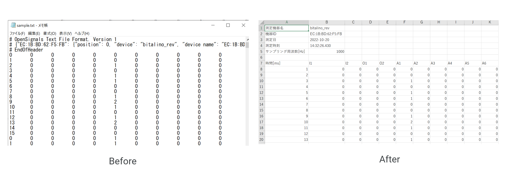
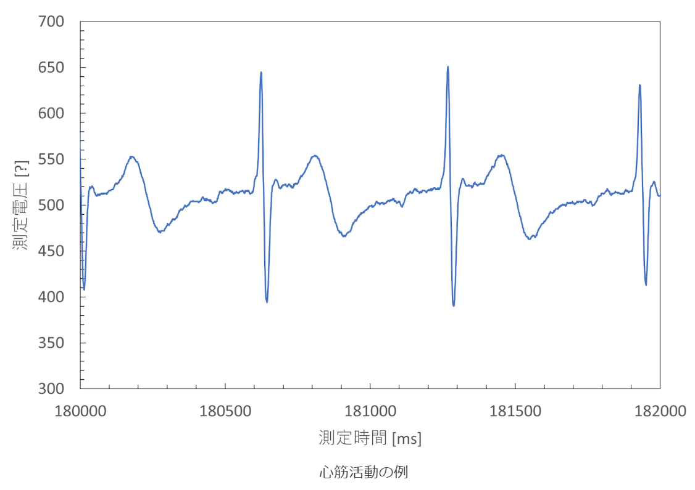

# OpenSignalsConverter
BITalino のセンサーで測定したデータを保存するとJSON形式を含むタブ区切りのデータが保存されます。この形式のままでは非常に扱いにくいので、Excel 形式で開けるように変換するコンソールアプリを作ってみました。

サンプルデータもあるので、試してみたい方は [Release](https://github.com/takunology/OpenSignalsConverter/releases) の Asset からダウンロードしてみてください。

## 動作環境（確認済み）

- Windows 10
- Windows 11

いずれも .NET 6.0 ランタイムをインストールしていることが条件。

# 準備
アプリを動かすには .NET 6.0 のランタイムが必要ですので、[こちら](https://dotnet.microsoft.com/ja-jp/download/dotnet/6.0)からダウンロードしてください。.NET Runtime の「インストーラー」からどうぞ。

次に、アプリをダウンロード＆インストールします。GitHub の [Release](https://github.com/takunology/OpenSignalsConverter/releases) から最新バージョンを探してください。 Assets に OpenSignalsConverter_v1.0.0.zip があるので、それをダウンロードして Zip ファイルを解凍してください。

画像の `setup` を開いてインストールを進めてください。



インストールが完了するとスタートからも開けるようになります。



# 使い方
1. アプリを開きます。



2. 測定データのある場所（パス）とファイル名、拡張子までつけて入力します。

もし、デスクトップなどに保存していた場合は下記のようなります。

```txt
C:\Users\ユーザ名\Desktop\sample.txt
```

3. 正しく読み込めれば、自動で変換が始まります。



4. 変換が完了したら、CSVファイルの保存先（パス）とファイル名（拡張子 .csv をつけて）を入れてください。

例えば、デスクトップに `data.csv` というファイル名で保存したい場合は下記のようになります。

```txt
C:\Users\ユーザ名\Desktop\data.csv
```

また、何も入力せずに Enter を押すと、読み込んだファイルと同じ名前、同じ場所に保存します。（拡張子は .csv になるので上書きはされません。）

**Warning**
同じ名前の csv ファイルがある場合は上書きされますので注意してください。

5. 正しく記入できれば保存先が表示されます。（場所によっては権限的な問題で保存できない場合があるので、その場合は別の場所に保存してください。）



6. 「すべての作業が完了しました。」という表記が出てきたらアプリを閉じても大丈夫です。適当なキーを入力しても閉じることができます。

## 変換前と変換後のファイル



あとはこれを Excel 形式に保存し直して、グラフをつくるとこんな感じになります。



エラーが出る場合は正しいファイル名でないか、測定データが破損している可能性があります。
なるべくバグは潰しているはずなのですが、あたらしいバグとか不具合とか見つけた場合は [issues](https://github.com/takunology/OpenSignalsConverter/issues) に投げておいてくれると助かります。オープンソースなので、もし直せる方、引き継げる方がいればパーミッションお渡しします。

## 今後のアップデート予定

- 測定データを電圧の値へ変換するための計算式導入
- 時間単位をミリ秒から秒へ変換

---

© Takumi Okawa / Takunoogy